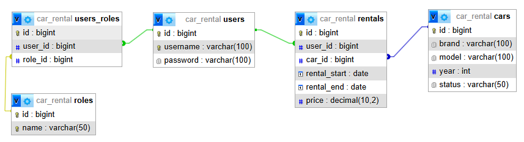

# Car Rental API

A simple RESTful API for managing a car rental service. This API provides user authentication with
role-based access control (**Admin**, **User**). Regular users can view and rent cars, while *
*Admins** can add new cars and manage the system.

---

## Features

- **User Authentication & Authorization**
    - Users have roles: **Admin** or **User**.
    - Endpoints are restricted by role.

- **Car Management**
    - **Admin** can add new cars, mark them as available/rented, and view all cars.
    - **Users** can view available cars.

- **Rentals**
    - **Users** can rent available cars.
    - **Users** can return rented cars.

---

## Database Schema



## Roles & Permissions

- **Admin**:
    - Add/update cars.
    - View all users.
    - Manage roles.

- **User**:
    - View available cars.
    - Rent and return cars.

---

## Security

This API uses JWT authentication for secure access. All protected endpoints require a valid token.

---

## RSA Key Generation

To generate RSA key pairs for JWT authentication, use the following commands:

### Generate a Private Key:

```sh
openssl genpkey -algorithm RSA -out src/main/resources/app.key -pkeyopt rsa_keygen_bits:2048
```

### Extract the Public Key:

```sh
openssl rsa -pubout -in src/main/resources/app.key -out src/main/resources/app.pub
```

Ensure that these keys are stored securely and never committed to version control.
